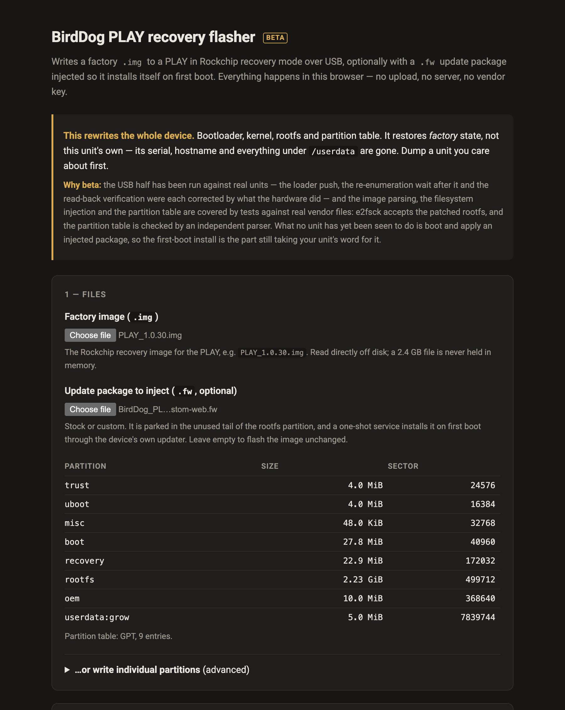
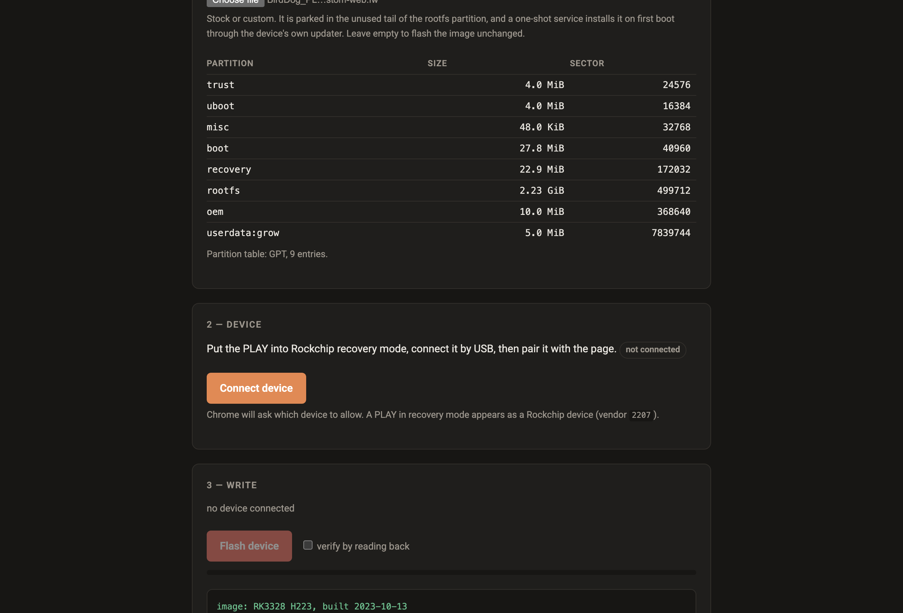

# BirdDog PLAY recovery flasher

A static web page that flashes a BirdDog PLAY in Rockchip recovery mode over USB, straight from
the browser — and, optionally, **injects a `.fw` update package into the image** so the device
installs it on first boot.

No upload, no server, no vendor key. You supply your own factory `.img`; the loader that gets
pushed over USB is extracted from that file in the browser at run time. That is the only reason
this repo can be public — see [AGENTS.md](AGENTS.md) §5.

> **Nothing here has been run against a PLAY yet.** The image parsing, the filesystem injection
> and the partition table are covered by tests against genuine vendor files. The USB half is
> written from rkdeveloptool's protocol, not from observation.



Both files above are real: a 2.3 GB factory `.img` and a 35 MB `.fw`. The image is read off
disk in slices and never held in memory, so choosing one costs nothing.



## What it does

| | |
|---|---|
| **Flash a factory `.img`** | Whole device: bootloader, u-boot, trust, kernel, DTB, rootfs, partition table. This is the brick-recovery path. |
| **Inject a `.fw`** | Parks the package in the unused tail of the rootfs partition and adds a one-shot service that installs it on first boot via the device's own updater. |
| **Write individual partitions** | The opposite job: put a *replacement* OS on a unit, writing only the partitions you name and leaving the rest — including the vendor's recovery partition — untouched. |
| **Verify** | Optional read-back and compare of everything written. |

## Writing individual partitions

Restoring a factory image and installing a replacement OS are different
operations, and this does the second one. Give it one file per partition — a
`boot` image and a `rootfs` filesystem, say — and it writes those and nothing
else.

Two things make it safer than the `dd`-at-an-offset it replaces:

- **It aims using the partition table read off the device**, not a sector copied
  out of a parameter file. A number in a script is right until it meets a unit
  that has already been reflashed, or is not a PLAY at all — which is precisely
  the case where a 3.5 GiB write at a plausible offset does real damage. The
  table is read, the header checksum is verified, partitions are matched by
  name, and a file too large for its target is refused rather than truncated.
- **`uboot`, `trust` and `recovery` are refused by default.** They are what
  loader mode and the vendor's restore depend on. Writing them is possible, but
  it takes a deliberate tick of an override, because getting them wrong is the
  difference between "flash it again" and "this unit is gone".

It needs the device in **loader mode**: a maskrom device cannot serve the LBA
reads used to fetch the partition table until a loader has been pushed into it,
and the loader comes out of a factory image.

Everything not listed is left exactly as it was, which is the whole point — it
is what keeps the factory recovery path available after you have replaced the OS.

## Why injection works

A `.fw` is not a partition image — it is a gzip'd tar whose `./update` runs as root **on a booted
device**. In maskrom mode there is no OS to run it, so it cannot simply be flashed. Two facts
from the factory image make the injection clean:

- **The rootfs partition has a 1.26 GiB hole.** `parameter.txt` gives rootfs 7,340,032 sectors
  (3.5 GiB) while `rootfs.img` is 2,399,595,520 bytes (2.235 GiB). Nothing ever grows into it —
  only `userdata:grow` grows, and that is a different partition. The package lives there as raw
  bytes, costing no filesystem space.
- **The rootfs is plain ext2** — `dir_index filetype` and nothing else. No journal, no extents,
  no metadata checksums. So three small files can be added to it correctly from JavaScript, and
  e2fsck agrees.

On first boot the injected service `dd`s the package back off the partition, hands it to
`BirdDogUpdateRunner` exactly as the vendor's own network path does, waits for the updater to
finish, and reboots. It marks itself done **before** installing, so a package that kills the box
cannot reinstall itself on every boot.

## Getting a PLAY into recovery mode

The recovery button is not on the outside of the case — it sits **inside the 3.5 mm headphone
socket**. Straighten a paperclip or use a SIM-eject tool, push it gently all the way in, and you
will feel the button click.

1. Power the unit off.
2. Push the pin into the headphone socket and hold the button down.
3. Still holding it, apply power, and keep holding for a few seconds after.
4. Connect USB, then release. The unit enumerates as vendor `2207`, in either *maskrom* or
   *loader* mode — the page reports which and handles both.

If it boots normally instead, the button was not held down far enough or long enough; the socket
is deep and the button is right at the bottom.

**Windows** needs [Zadig](https://zadig.akeo.ie/) to rebind the device to WinUSB, because
Rockchip's own driver claims it and WebUSB cannot then reach it. macOS needs nothing. Linux
needs a udev rule for `2207:*`.

## Installing a `.fw` on a unit that still boots

You do not need any of this to update a working PLAY — the device's own web interface does it.
Browse to the unit's IP address, log in, go to the **System** tab, and upload the `.fw` there.
The device installs it and reboots.

This tool is for the case where that is not an option: a unit that will not boot, will not take
a web-UI update, or needs the whole device put back to a known state. Injecting the `.fw` here
just saves a second trip once it is back up.

## Tests

```bash
npm test
```

CI-safe tests build their own ext2 filesystem with `mke2fs` and check the result with `e2fsck`,
`debugfs` and an independent Python GPT parser — no vendor files involved. The end-to-end tests
need real firmware and are skipped unless you point them at your own copies:

```bash
PLAY_IMG=~/Downloads/PLAY_1.0.30.img PLAY_FW=~/fw/BirdDog_PLAY-1.0.34.fw npm test
```

## Deploying

```bash
cf-run npx wrangler deploy
```

Assets only — there is no Worker, because there is nothing for a server to do. Deliberately not
connected to Workers Builds, so pushing a branch cannot publish to production.

## Licence

MIT. Built with AI assistance. Not affiliated with, endorsed by, or supported by BirdDog.
